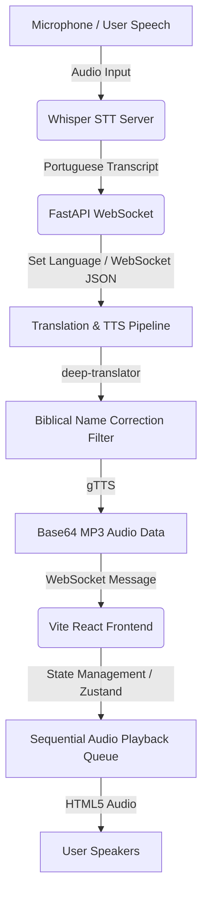

# 🔴 Auto-Transcriber

Auto-Transcriber is a real-time, voice-to-text translation and Text-to-Speech (TTS) streaming application. It transcribes spoken Portuguese (pt) speech using a local high-accuracy Whisper instance, translates the finalized sentences on the backend to a target language (English, Dutch, Spanish, French, German, or Italian), and streams the TTS voice synthesis back to the frontend. The frontend queues and autoplays the incoming speech clips sequentially to ensure an uninterrupted, non-overlapping listening experience.

Additionally, the system is primed specifically for **Christian & Biblical context**, implementing custom transcription prompts and language-specific translations for biblical proper names.

---

## 🛠️ Architecture Overview



---

## ✨ Key Features

- **High-Accuracy Speech-to-Text**: Powered by `RealtimeSTT` and `faster-whisper` (`large-v3-turbo`) with a configured search beam size of `5`.
- **Christian Text Tailoring**: 
  - Primed with an `initial_prompt` containing key Portuguese Christian names and terms to guide the acoustic spelling.
  - Custom post-translation dictionary mappings (`CHRISTIAN_MAPPINGS` in `connections.py`) that rewrite literal/incorrect translation names into accurate biblical equivalents (e.g. *Tiago* $\rightarrow$ *James* in English, *Jakobus* in Dutch).
- **Backend Translation & TTS**: Translates text and synthesizes speech on the server side using thread-pool executors to prevent blocking.
- **Autoplay Audio Playback Queue**: Frontend queues incoming MP3 streams and plays them sequentially (using `onended` callbacks) rather than playing them all at once, ensuring a smooth, natural-sounding voice stream.
- **Mute / Unmute Capability**: A speaker icon in the frontend allows users to mute the stream at any time, clearing the queue and silencing any active playback.

---

## 🚀 Setup & Execution Guide

### 1. Backend Setup (FastAPI)

Navigate to the `backend/` directory, set up your Python virtual environment, and install dependencies.

```bash
cd backend
python -m venv venv
```

#### Activate the Environment
* **Windows:**
  ```powershell
  .\venv\Scripts\activate
  ```
* **Mac/Linux:**
  ```bash
  source venv/bin/activate
  ```

#### Install PyTorch & Dependencies
To run Whisper with GPU acceleration (strongly recommended for CUDA-enabled systems), install PyTorch with CUDA support first:

* **Windows/Linux (with NVIDIA GPU - CUDA 12.1):**
  ```bash
  pip install torch torchvision torchaudio --index-url https://download.pytorch.org/whl/cu121
  ```
* **Mac / CPU-only Systems:**
  ```bash
  pip install torch torchvision torchaudio
  ```

* **Install Application Requirements**:
  ```bash
  pip install -r requirements.txt
  ```
  *(Installs: `fastapi`, `uvicorn`, `websockets`, `RealtimeSTT`, `deep-translator`, and `gTTS`)*

#### Run the Server
```bash
python main.py
```
The server will start on `http://localhost:8000`.

---

### 2. Frontend Setup (React + Vite)

The frontend project is located in `AutoTranscriber/`. You can run it either locally with Node/Bun or using Docker.

#### Option A: Local Run (Bun / Node)
1. Navigate to the frontend directory:
   ```bash
   cd AutoTranscriber
   ```
2. Install dependencies:
   ```bash
   bun install
   # or
   npm install
   ```
3. Run the development server:
   ```bash
   bun run dev
   # or
   npm run dev
   ```

#### Option B: Docker Compose
Build and run the container from the root directory:
```bash
docker-compose up --build
```
Open your browser and navigate to `http://localhost:5173`.

---

## 📖 Under the Hood: Technical Details

### Christian Translation & Proper Name Mappings
To ensure proper translation of biblical names, the backend runs translated strings through a regex-based correction filter. For example:
- **Portuguese name**: *"Tiago"*
- **Default Translation (Google)**: *"Thiago"* or *"Santiago"*
- **Dutch Holy Bible Equivalent**: *"Jakobus"*
- **English Holy Bible Equivalent**: *"James"*

The mapping config looks like this in `backend/connections.py`:
```python
CHRISTIAN_MAPPINGS = {
    "en": {
        "Espírito Santo": "Holy Spirit",
        "Tiago": "James",
        "João": "John",
        ...
    },
    "nl": {
        "Espírito Santo": "Heilige Geest",
        "Tiago": "Jakobus",
        "João": "Johannes",
        ...
    }
}
```

### Sequential Autoplay Queue
Browsers block audio autoplay until a user interacts with the page. To manage this gracefully:
1. The user clicks **Connect** (which counts as an interaction).
2. Incoming base64 audio clips are added to `audioQueue`.
3. If `isPlayingAudio` is false, playback begins on the first clip.
4. Each clip listens for `onended`. When finished, it shifts the queue and triggers `playNextAudio`.
5. If the browser blocks playback due to policy, the error is caught and the queue continues rather than locking up.
